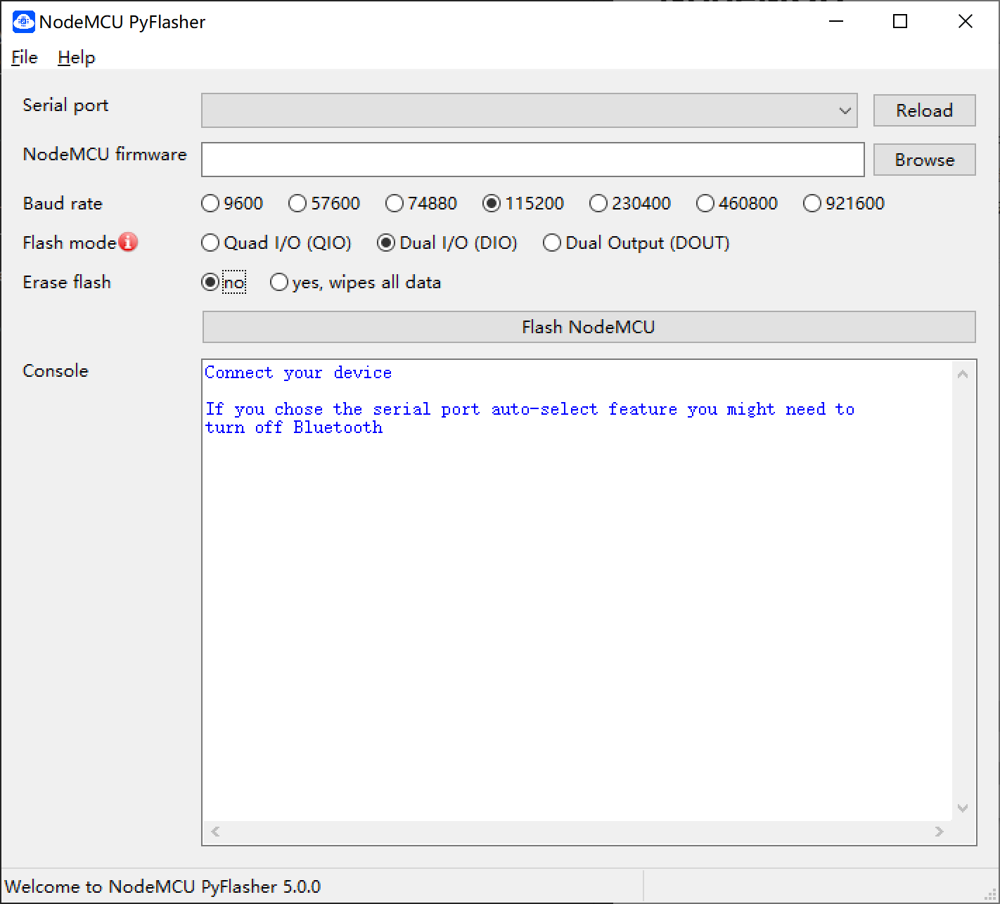

## NodeMCU

### 烧录

#### NodeMCU-PyFlasher.exe
下载 
https://github.com/marcelstoer/nodemcu-pyflasher/releases

  

选 “Erase flash” “yes”
下载完成后只按 reset 键不行，要断开电源线（usb线）  

#### flash_download_tool_3.9.4
下载到 0x0 ？

### nodemcu

https://nodemcu-build.com/ 在这里生成 bin 

### wifikiller

[https://github.com/SpacehuhnTech/esp8266_deauther](https://github.com/SpacehuhnTech/esp8266_deauther)  

下载 esp8266_deauther_2.6.1_NODEMCU.bin

### MicroPython

http://docs.micropython.org/en/latest/esp8266/quickref.html

下载 esp8266-20230426-v1.20.0.bin
https://micropython.org/download/esp8266/

### 官方SDK
