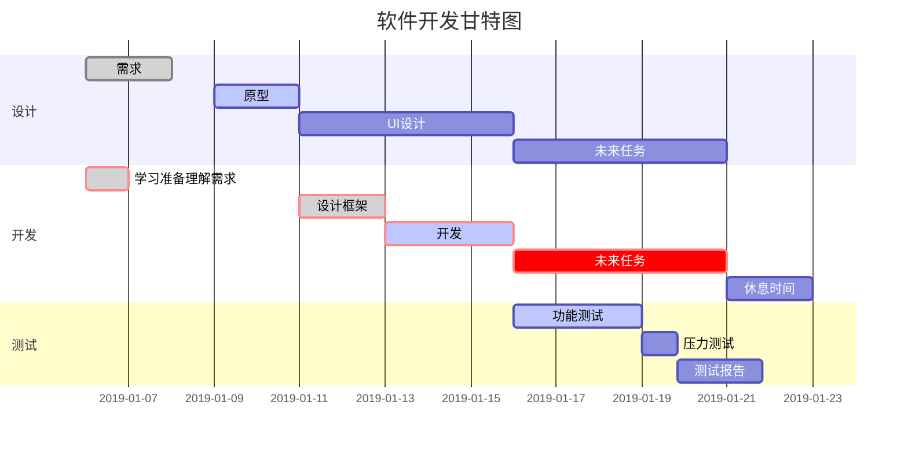
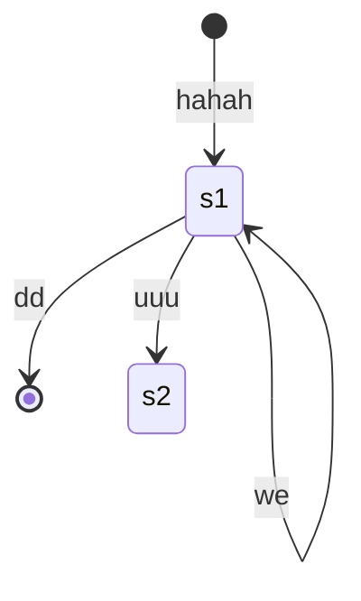
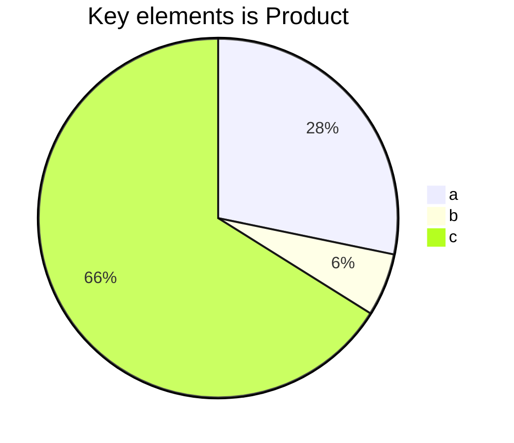

# 标题

http://www.mdeditor.com/

[HTML 手册](https://www.zixuephp.net/manual-html-936.html)  

以下是标题样式：
# 我是大标题
## 标题2
### 标题3
#### 标题4
##### 标题5
###### 标题6

我是正文，我是主力军

## 字体
<font face="黑体">我是黑体字</font>  
<font face="微软雅黑">我是微软雅黑</font>  
<font face="STCAIYUN">我是华文彩云</font>  
<font color=red>我是红色</font>  
<font color=#008000>我是绿色</font>  
<font color=Blue>我是蓝色</font>  
<font size=5>我的尺寸是5</font>  
<font face="黑体" color=green size=5>我是黑体，绿色，尺寸为5</font>  

<table><tr><td bgcolor=yellow>我的背景色是yellow</td></tr></table>
<b><font color=red>加粗并红色</font></b>

**我被加粗了**
*我是斜体我歪了*
***我不但粗，还歪***
~~卧槽，我被删除了~~

<del>卧槽，我也被删除了<del/>

`我亮了`


## 引用
引用可以嵌套很多层
>这是引用的内容
>>这是引用的内容
>>>>>>>>>>这是引用的内容，
如何结束引用呢？


## 分割线  
---
三个或者三个以上的 - 或者 * 都可以


我的后面有回车<br/>确实如此，
后面加两个空格再回车，也是换行的效果  
没错

&emsp;&emsp;我的前面有空格缩进


我是一个[超链接](https://xuruidong.github.io/),可以跳转到 xuruidong.github.io


## 代码
写一行代码，调一天bug
`printf("Hello World!");`

写个函数吧
```
int func(int i)
{
    printf("%d\n", i+100);
    return i*i;
}
```

---


[markdown plus](http://mdp.tylingsoft.com/)

```sequence
Title:abc
123->abc:what
abc-->123:yes
abc->bbb:en
123->ccc:
```





```flow
st=>start: 开始
ipt=>inputoutput: 输入一个x
op=>operation: 处理加工x+1
cond=>condition: 溢出（是或否？）
sub=>subroutine: 子流程
io=>inputoutput: 输出x
ed=>end: 结束

st->ipt->op->cond
cond(yes)->io->ed
cond(no)->sub->io->ed
```



