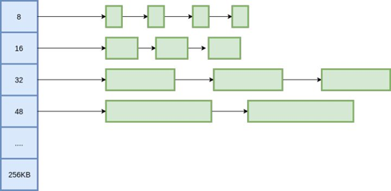

# 内存池

## 为什么需要内存池

首先看一个例子
```
#include <unistd.h>
#include <stdio.h>
#include <time.h>

int main(void)
{
    void *p = sbrk(0);
    clock_t count = clock();
    int i = 0;

    for(i=0; i<0xfffff; i++){
        int *p1 = (int *)p;
        int ret = brk(p1 + 1024); // malloc 1k
        p1[100] = 100;
        ret = brk(p);   // free 1k
    }

    printf("Interval = %d ticks\n",(int) (clock()-count));
    return 0;
}
```
运行结果：Interval = 6680000 ticks
系统调用 brk 可以用来申请和释放内存，性能比较低  

示例2：
```
#include <unistd.h>
#include <stdio.h>
#include <time.h>

class CTestClass
{
    char m_charBuf[4096];
};

int main(void)
{
    clock_t count = clock();
    int i = 0;

    for(i=0; i<0xfffff; i++){
        CTestClass *p = new CTestClass;
        delete p;
    }

    printf("Interval = %d ticks\n",(int) (clock()-count));
    return 0;
}

```
运行结果：Interval = 80000 ticks
系统调用brk性能很低，所以glibc对brk进行了封装， 提高了效率。

示例3:
```
#include <stdio.h>
#include <time.h>
#include <gperftools/tcmalloc.h>

class CTestClass
{
        char m_charBuf[4096];
};

int main(void)
{
        clock_t count = clock();
        int i = 0;

        for(i=0; i<0xfffff; i++){
                CTestClass *p = new CTestClass;
                delete p;
        }

        printf("Interval = %d ticks\n",(int) (clock()-count));
        return 0;
}

```
编译时需要链接tcmalloc库， -ltcmalloc
https://gperftools.github.io/gperftools/tcmalloc.html
执行结果：
Interval = 30000 ticks


示例4：
```
#include <stdio.h>
#include <time.h>


char buf[4100];

class CTestClass
{
        char m_charBuf[4096];
public:
        void * operator new(size_t size){
                return (void *)buf;
        }
        void operator delete(void *p){

        }
};

int main(void)
{
        clock_t count = clock();
        int i = 0;

        for(i=0; i<0xfffff; i++){
                CTestClass *p = new CTestClass;
                delete p;
        }

        printf("Interval = %d ticks\n",(int) (clock()-count));
        return 0;
}

```
执行结果： Interval = 10000 ticks

### 总结
1. 内存分配性能：  
brk --> glibc --> tcmalloc / jemalloc --> 内存池（用户态）
2. 工程的角度，可以防止程序因为内存错误（不当使用）而造成的崩溃或者其它各种各样的问题

## 为什么内存分配性能存在差异？
* 使用brk系统调用, 经过了内核对内存进行管理操作，将内存在内核态与用户态之间切换。
内核中有一系列的内存管理算法，而且要将用户态进程挂起，去执行内核态程序，然后再恢复到用户态，即系统调用的上下文切换。

* Glibc  ptmalloc，预先分配好一大块内存，然后根据不同尺寸大小进行拆分，相同大小的内存块，使用链表进行管理，根据用户申请内存的大小， 返回相应的内存块。 如果用户申请时没有对应的内存块， 则会向系统申请一大块，加入管理链表，并返回给用户。释放时， 也不返回给操作系统，直接由glibc去回收，插入到管理链表中。这样就避免频繁得调用系统调用问内核要内存，尽量避免频繁使用brk。
当用户申请大块内存时，还是直接向操作系统申请的。所以频繁申请释放大块内存， 性能也是比较低下的。
Ptmalloc是线程安全的。所以每次申请释放都会进行加锁。


* Tcmalloc/jemalloc 的实现与ptmalloc思路相似，但tcmalloc将预先申请的内存区域分成了多个子区域，每个子区域是线程独有的，创建多少个线程，就会分出多少块子区域。线程申请内存时， 就会到对应的内存区域中去分配，这样就不需要进行加锁操作。
当线程对应的内存块不够用时， 会向中央堆去申请，当线程空闲多了， 也会还给中央堆。中央堆管理着大部分的内存。 线程内存块虽然是独立的， 但由于中央堆的存在，使其互联互通。
tamalloc为了要满足各种尺寸申请和释放，所以算法复杂，所以这里就有了内存池技术的必要性

## 内存池的设计要考虑哪些方面
1.	尺寸    是需要不同的尺寸，还是固定的尺寸
2.	线程安全
3.	内存空间的大小是否可以调整

## ringbuffer
类似内核中的 kfifo  

参考 x_ring 实现

## multiple-ringbuffer

参考 x_ring 实现

