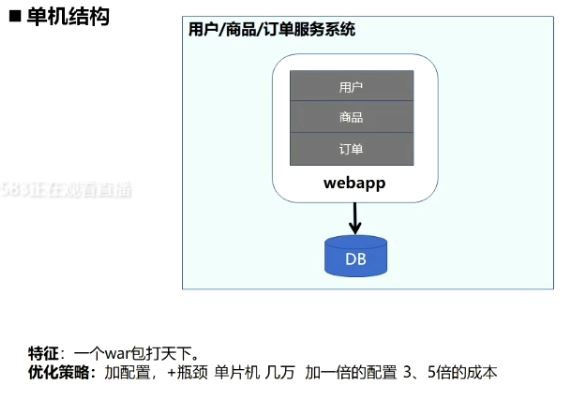
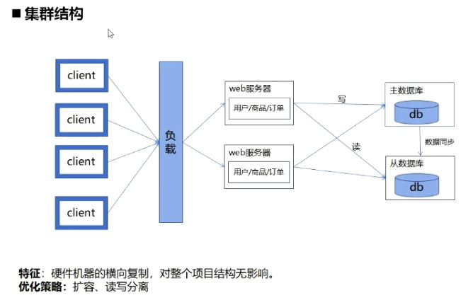
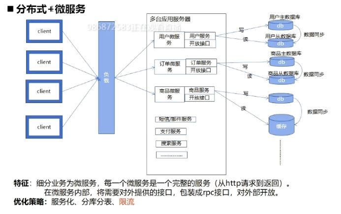

## 服务结构

### 单机结构

### 集群结构

### 分布式+微服务

分库分表，缓存

## 限流
系统的访问量达到一定的阈值，就采取一些措施进行限制，比如：延迟处理，拒绝访问，部分拒接处理（比如只处理下单支付功能，发货、通知等拒绝）

## 限流算法
计数器算法，令牌桶算法，漏桶算法

### 计数器算法

算法缺点：
临界问题

### 令牌桶算法

  

系统每秒向桶中放入5个令牌，桶的容量是5，如果桶已满，则令牌被丢弃。系统处理请求时，需先从令牌桶中拿到令牌，然后再进行处理。如果令牌人中没有令牌，则该请求被限制。

* 没有临界问题
* 缓冲区 比如桶中已经有5个令牌，第一秒可处理的最大请求数为10 （桶中有5个 + 1秒生成5个），后续请求会限制在每秒5个
* 允许突发  允许请求一次请求处理拿多个令牌

Guava 框架中的RateLimiter 类

## 限流的层面
接入层限流，应用层限流

如果是针对部分服务进行限流，需要在应用层

## 分布式下的应用限流难点
* 应用部署有多台，需要进行全局限流
* 负载均衡不一定能够均分请求

### 解决方案：  
一个全局的“计数器” 或者桶
限流处理需要做成原子的

### 全局计数器--redis
基于键值对的内存数据库
提供健过期机制
操作原子性

Redis 结合lua实现分布式场景下的限流